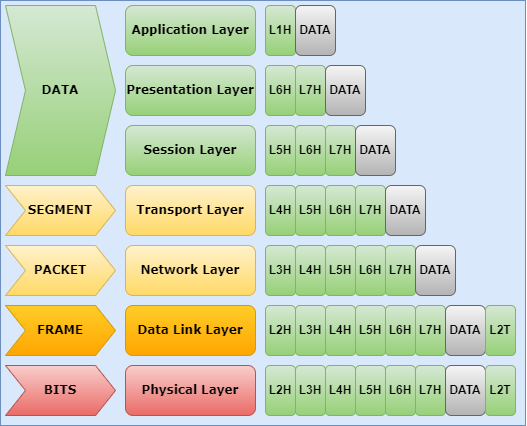

# OSI model
A representation of the OSI Model with an explanation and example for each layer. At the end of this document there will be a summarizing example including every layer of the OSI model.

## Intro

The **Open Systems Interconnection model or OSI model** is a reference model for data communication standards. This model is split in seven layers which are the physical, data link, network, transport, session, presentation and application layer. You can memorize the different layers by using the mnemonic: **P**lease **D**o **N**ot **T**hrow **S**ausage **P**izza **A**way.

## Layer 1: Physical

## Layer 2: Data link Layer

## Layer 3: Network Layer

## Layer 4: Transport Layer

## Layer 5: Session Layer

## Layer 6: Presentation Layer

## Layer 7: Application layer
This is the closest layer to the end user and represents the application protocols. These protocols facilitate communications between your application and your operating system and interacts with other commnication systems. An example is HTTP or Hypertext Transfer Protocol which provides communications from webclient to webserver.

## Summarizing example
